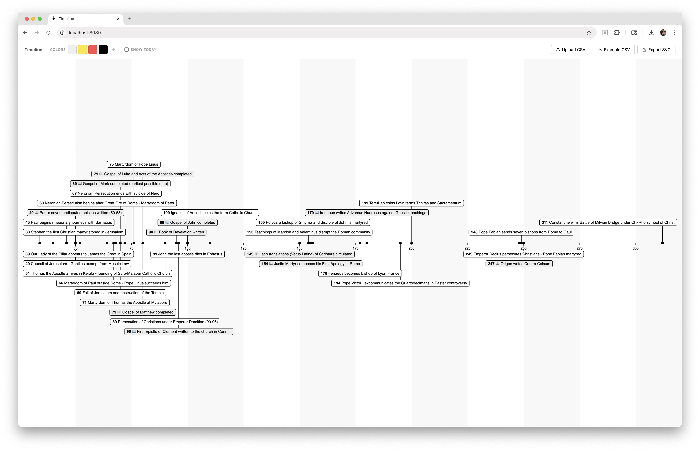

# Timeline



A simple tool for visualizing historical events as a timeline. Exports as SVG

## Usage

1. Click **Upload CSV** to load your data
2. Use the **Colors** swatches to customize category colors
3. Click **Export SVG** to download the timeline as a vector file

## CSV Format

```
date,name,category
1969-07-20,Apollo 11 Moon landing,space
1903-12-17,Wright Brothers first flight,aviation
```

- **date** — ISO format (`YYYY-MM-DD`). Ancient dates should be zero-padded (e.g. `0034-01-01`)
- **name** — Event label. Emojis are supported
- **category** _(optional)_ — Categories are assigned colors from the palette in order of first appearance. If no category value set, the background is white.

Click **Example CSV** in the app to download a sample file illustrating the format.

## Example Datasets

The `data/` folder includes ready-to-use datasets:

| File                     | Description                                                                                                 |
| ------------------------ | ----------------------------------------------------------------------------------------------------------- |
| `napoleon.csv`           | Napoleon's major battles (1793–1815), categorized as `win` or `loss`                                        |
| `early_christianity.csv` | Key events in early Christian history (34–312 AD), with `gospel` category for events realted to authorship. |

## Features

- Fits the full date range to the window automatically
- Labels are collision-free — overlapping events are staggered vertically
- Tag text color adjusts automatically for contrast against the category background color
- Print-friendly: hides controls and scales the SVG to fit a landscape page
